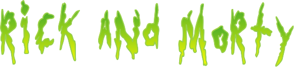

<h1 align="center">
    
</h1>

  <a href="#-technologies">Technologies</a>&nbsp;&nbsp;&nbsp;|&nbsp;&nbsp;&nbsp;
  <a href="#-howtorun">How to run</a>&nbsp;&nbsp;&nbsp;|&nbsp;&nbsp;&nbsp;
  <a href="#-prerequisites">Prerequisites to run</a>&nbsp;&nbsp;&nbsp;|&nbsp;&nbsp;&nbsp;
  <a href="#memo-license">License</a>

This project was developed with the following technologies:

- [React](https://reactjs.org)
- [TypeScript](https://www.typescriptlang.org/)
- [Tailwindcss](https://tailwindcss.com/)

## 💻 Project

Select favorites characters from the Rick And Morty sitcom.

## 🛠️ Prerequisites to run

    1 - Node version 15.5.1.
    2 - Yarn version 1.22.10 (optional, but recommended).

## 🏃‍♂️ How to run

    1 - Clone this project using `git clone https://github.com/pgThiago/RickAndMorty.git` command.
    2 - In the project root run `yarn` to install all dependencies.
    3 - Run `yarn start` to start the application in http://localhost:3000.

## :memo: License

This project is under MIT license. Check the file [LICENSE](LICENSE.md) for more details.
